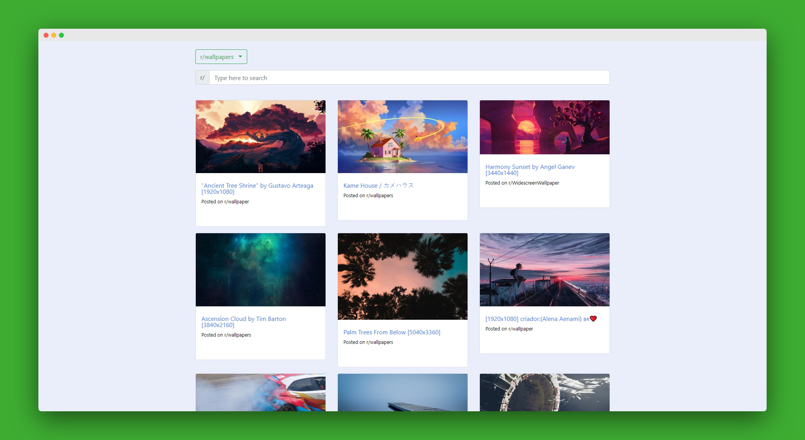

# Wallpapers from Reddit

## [Check live demo!](https://wallpapers-mf.netlify.com/)

This application was made to browse wallpapers and images using the Reddit API. The app looks for available images in the thread and lists them.

## How to Use

Use the search bar to enter a thread name then it submits your request. The app returns data depending on your input. 

## Built With

- React JS
- Reddit API
- SCSS
- Bootstrap 4
- Lodash to delay the input
